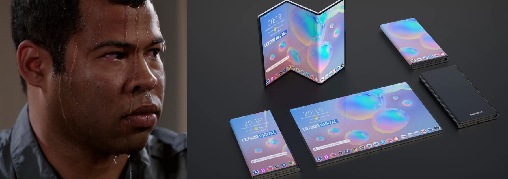
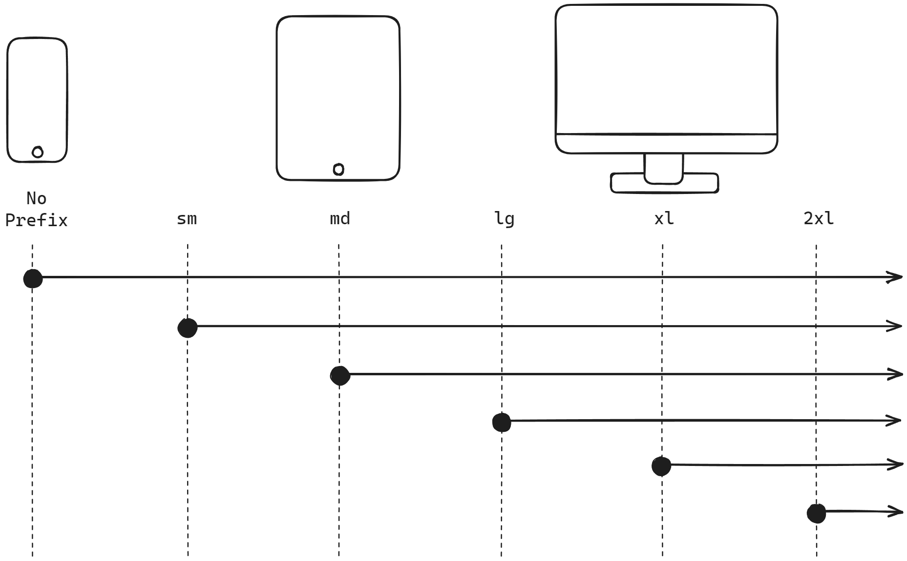

Responsive web design is essential in today's web applications as it ensures that they adapt to different screen sizes and devices, providing an optimal user experience.

In this blog post, we will explore how to achieve responsive design using Tailwind, a powerful and straightforward utility-first CSS framework.

## What is responsive design?

Responsive design is an approach to web design that allows web applications adjusting their layout and content automatically based on the user's device and screen size, providing an optimal viewing experience across various devices.



Responsive design is becoming more and more challenging to achieve due to diverse device types. *I mean, just look at those folding screens. It's getting complicated.*

However, with the emergence of modern CSS technologies like Tailwind CSS, implementing responsive designs has become much more accessible and efficient.

## Breakpoint prefixes

There are five breakpoints by default, which Tailwind team got inspired by common device resolutions:
| Breakpoint | Minimum width |
| :--------- | :------------ |
| `sm:`      |  640px        |
| `md:`      |  768px        |
| `lg:`      |  1024px       |
| `xl:`      |  1280px       |
| `2xl:`     |  1536px       |

Simply prefix the utility with the breakpoint name, followed by the `:` character, to add a utility that only activates at a specific breakpoint.

```html
<!-- Width 4 by default -->
<!-- Width 8 for screens with larger than 768px width (md) -->
<!-- Width 12 for screens with larger than 1024px width (lg) -->
<button class="w-4 md:w-8 lg:w-12" />
```

## Mobile-first by default

By default, Tailwind uses a mobile-first approach for its breakpoint system, much like what you may be familiar with in other frameworks such as Bootstrap.



That means if mobile devices are targeted, you need to start styling without any prefix, not the `sm:` prefixed version. Any unprefixed utility take effect on all screen sizes.

```html
<!-- Center text on mobile -->
<!-- Align left for all other screens -->
<div class="text-center sm:text-left"></div>
```

## Custom responsive layouts

<div className="relative flex items-center justify-center h-96 border-2 rounded-lg resize-x overflow-auto w-full max-w-full min-w-[302px] bg-[url('/examples/dot-pattern.svg')] bg-repeatbg-[length:50px]">
    <div className="absolute w-full h-full bg-gradient-to-tl from-white to-transparent from-10%"/>
    <iframe src="/examples/responsive.html" className="z-10 h-full w-full my-auto"/>
    <p className="absolute -bottom-3 right-2 text-base px-2 py-1 border rounded bg-white hidden sm:block">Resize here &#8600;</p>
</div>

We added the breakpoint `sm:` to make the card above responsive. And here is how it works:
- Flex direction is column by default (`flex-col`)
- Flex direction is row for screens bigger than `sm` (`sm:flex-row`)
- Image height is 28 by default (`h-28`)
- Image height is 40 for screens bigger than `sm` (`sm:h-40`)

```html
<div class="flex flex-col sm:flex-row items-center gap-8 border-2 rounded-lg p-4 bg-white shadow-xl">
    
    <p>
        A lake is a body of water that is surrounded by land.
        There are millions of lakes in the world.
    </p>
</div>
```

You made a great introduction to the responsive design with Tailwind. The Tailwind team did a magnificent job with their docs. For further explanation and examples you can always check out the <a href="https://tailwindcss.com/docs" rel="noopener noreferrer" target="_blank">official Tailwind docs</a>.