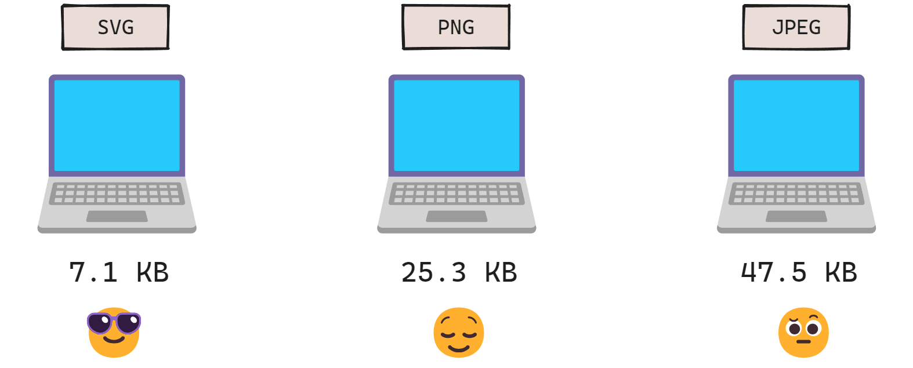
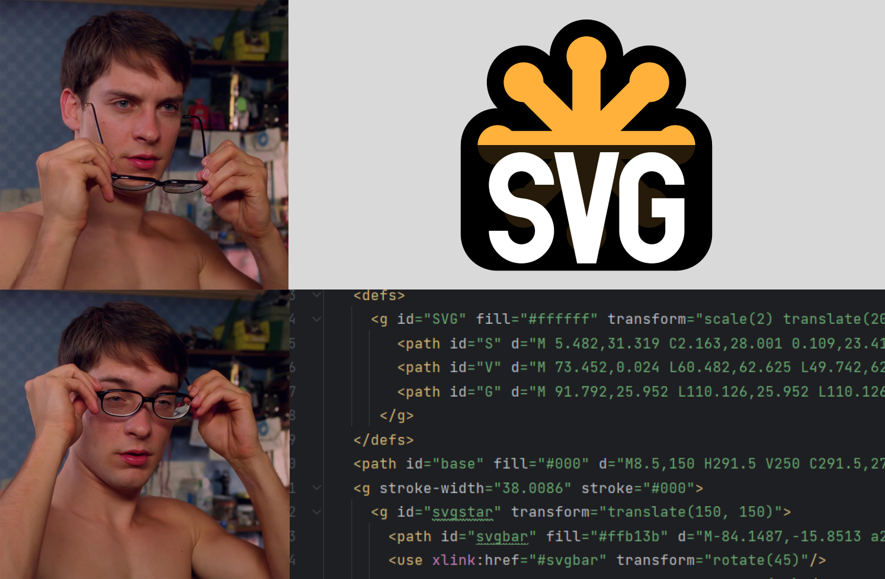

Every web developer has heard of SVGs. It's becoming increasingly popular these days, thanks to its advantages over raster graphics.

As the name suggests (SVG stands for Scalable Vector Graphics), they are **scalable**, meaning they can be displayed at any resolution. SVGs are **small** in size compared to raster images, which is very important as package sizes are getting bigger these days.



SVGs are **easy to edit** because they are code-based. They consist of basic geometric shapes and paths. This also allows them to be animated to add interactivity.



These are reasons to use SVG in your next project. But how do you use SVGs in a React application?

## 1. Implement the path directly

Similar to raster images, SVGs can be implemented by specifying the path using the `src` attribute in the image tag.

```html

```

The path can either be relative or absolute.

```html

```

## 2. Import the SVG locally

Webpack's built-in SVG support allows importing and including local SVGs in the image tag.

```jsx
import pancake from "../images/pancake.svg";

function Breakfast() {
    return (
        <div>
            
            <p>Yummy!</p>
        </div>
    );
}
```

## 3. Create React component from SVG

When we open an SVG file in a code editor, we can see an `svg` element just like any other HTML element.

```html
<svg width="200" height="200" xmlns="http://www.w3.org/2000/svg">
  <rect width="100" height="100" x="50" y="50" class="rectangle" />
</svg>
```

You can add the code in the SVG directly into a JSX. This way you can create a component consisting of an SVG.

```jsx
function MyIcon() {
    return (
        <svg width="200" height="200" xmlns="http://www.w3.org/2000/svg">
            <rect width="100" height="100" x="50" y="50" className="rectangle" />
        </svg>
    );
}
```

However, you need to keep in mind that you need to change certain attributes to their **camelCase** versions while translating into JSX.

For example:
- `class` &rarr; `className`
- `fill-opacity` &rarr; `fillOpacity`
- `letter-spacing` &rarr; `letterSpacing`

## 4. Using SVGR to create components

Another way to add SVGs to a React application is to use the <a href="https://react-svgr.com/" target="_blank">SVGR</a> library.

First, install the package by running the code below:
```bash
npm install --save-dev @svgr/webpack
# or use yarn
yarn add --dev @svgr/webpack
```

Then, update the **webpack.config.js**:

```js
module.exports = {
    module: {
        rules: [
            {
                test: /\.svg$/i,
                issuer: /\.[jt]sx?$/,
                use: ['@svgr/webpack'],
            },
        ],
    },
}
```

You can now import any SVG and utilize it similar to a React component. It's that simple!

```jsx
import Pancake from "../images/pancake.svg";

function Breakfast() {
    return (
        <div>
            <Pancake />
            <p>Yummy!</p>
        </div>
    );
}
```

There are various reasons to utilize SVGs. This blog post has explained what an SVG is and how to add it to your next React application.

However, when it comes to icons, there's a great library, by the makers of Tailwind CSS, you might want to consider using: <a href="https://heroicons.com/" target="_blank">Heroicons</a>. I use Heroicons in my projects frequently and I love it.

You can check out the <a href="https://github.com/tailwindlabs/heroicons" target="_blank">official documentation</a> to see how to use it with React.